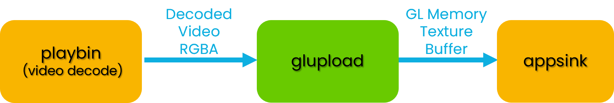
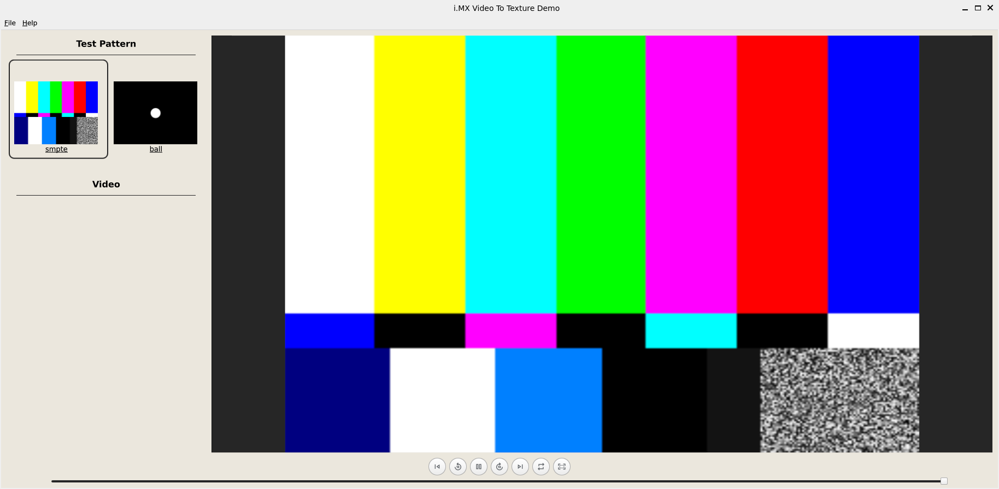
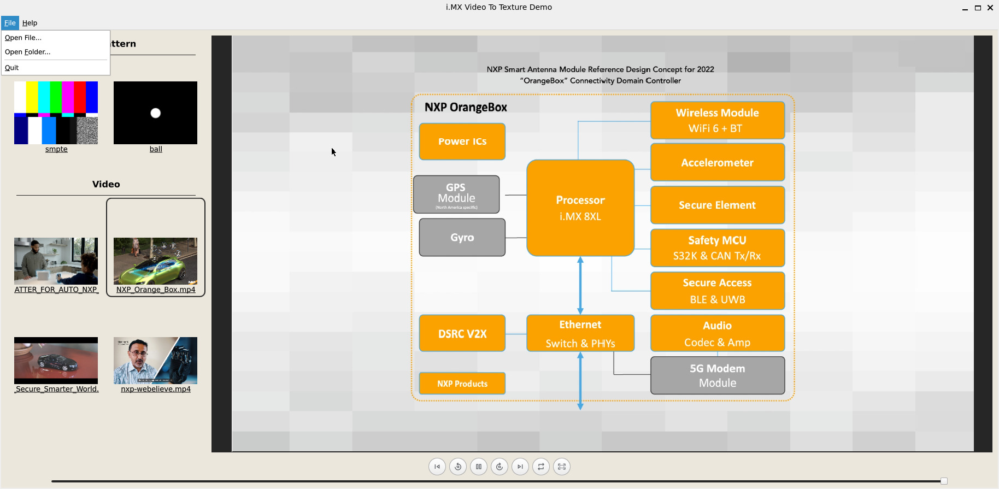
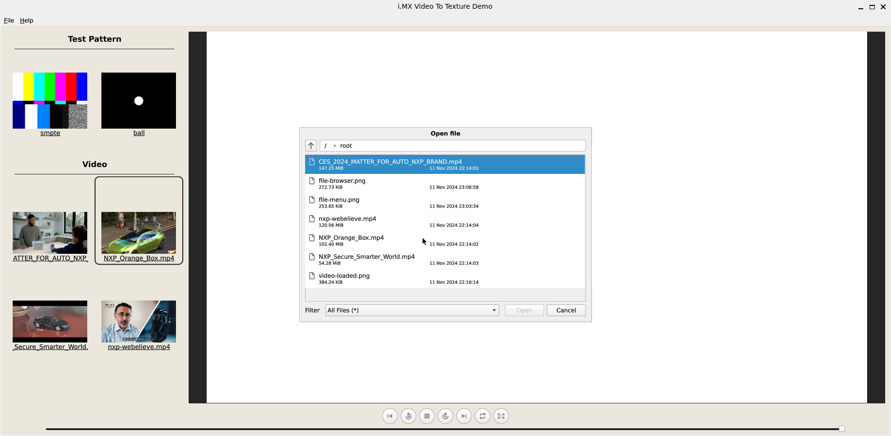
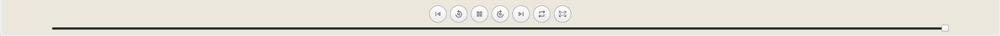

# i.MX Video To Texture

<!----- License, Board, Category ----->
[](./licenses/BSD\-3\-Clause.txt)
[](https://www.nxp.com/products/processors-and-microcontrollers/arm-processors/i-mx-applications-processors/i-mx-9-processors/i-mx-95-applications-processor-family-high-performance-safety-enabled-platform-with-eiq-neutron-npu:iMX95)
[](https://www.nxp.com/products/processors-and-microcontrollers/arm-processors/i-mx-applications-processors/i-mx-8-applications-processors/i-mx-8-family-arm-cortex-a53-cortex-a72-virtualization-vision-3d-graphics-4k-video:i.MX8)


NXP's *GoPoint for i.MX Applications Processors* unlocks a world of possibilities. This user-friendly app launches
pre-built applications packed with the Linux BSP, giving you hands-on experience with your i.MX SoC's capabilities.
Using the i.MX 8QM MEK or i.MX 95 EVK you can run the included *i.MX Video To Texture* application available on GoPoint
launcher as part of the BSP flashed on to the board. For more information about GoPoint, please refer to the GoPoint for i.MX Applications Processors User's Guide for the current
[NXP Linux BSP release](https://www.nxp.com/design/design-center/software/embedded-software/i-mx-software/embedded-linux-for-i-mx-applications-processors:IMXLINUX).

[*i.MX Video To Texture*](https://github.com/nxp-imx-support/imx-video-to-texture) demo is a video player application that renders a video stream into a GUI application along with a thumbnails panel that shows preview of video sample patterns and video files from a directory. This project demonstrates how to render a GStreamer stream into an OpenGL-ES texture that can be integrated in user application with no buffer copy.

## Implementation using GStreamer and Qt

In this sample, the GStreamer pipeline uses *glupload* element to render the stream into an OpenGL texture. Mapping the OpenGL texture to the video buffer is done in GStreamer plugin using Linux dma-buf. The application retrieves the OpenGL texture ID used by the GStreamer pipeline and uses it in an OpenGL context.



The application GUI was created using the Qt framework.
The Qt framework creates and provides an EGL context to GStreamer allowing GStreamer to share the video frames as OpenGL textures with Qt for rendering. The GStreamer pipeline uses an *appsink* element to provide the OpenGL texture ID to the application.



Test patterns from GStreamer can be played from the left panel for ease of use. Using *File/Open Folder* menu, user can also select a folder containing video files that will be shown in the Video section. For simplicity's sake, only *mkv* and *mp4* files are supported in this demo. But source code, and especially GstPlayer module, can be reused to play any pipeline supported by the device.

## Table of Contents

1. [Software](#1-software)
2. [Hardware](#2-hardware)
3. [Setup](#3-setup)
4. [Results](#4-results)
5. [FAQs](#5-faqs)
6. [Support](#6-support)
7. [Release Notes](#7-release-notes)

## 1. Software

*i.MX Video to Texture* is part of Linux BSP available at [Embedded Linux for i.MX Applications Processors](https://www.nxp.com/design/design-center/software/embedded-software/i-mx-software/embedded-linux-for-i-mx-applications-processors:IMXLINUX). All the required software and dependencies to run this
application are already included in the BSP.

i.MX Board          | Main Software Components
---                 | ---
**i.MX 95 EVK** | GStreamer, GStreamer-gl, Qt6
**i.MX 8QM MEK** | GStreamer, GStreamer-gl, Qt6

>**NOTE:** If you are building the BSP using Yocto Project instead of downloading the pre-built BSP, make sure
the BSP is built for *imx-image-full*, otherwise GoPoint is not included. The i.MX Video to Texture software is only
available in *imx-image-full*.

## 2. Hardware

To test *i.MX Video to Texture* demo, either the i.MX 95 EVK, or i.MX 8QM MEK are required with their respective hardware components.

Component                                         | i.MX 95 EVK        | i.MX 8QM MEK
--                                                | :--:               | :--:
Power Supply                                      | :white_check_mark: | :white_check_mark:
HDMI Display                                      | :white_check_mark: | :white_check_mark:
USB micro-B cable (Type-A male to Micro-B male)   |                    | :white_check_mark:
USB Type-C cable  (Type-A male to Type-C male)    | :white_check_mark: |
HDMI cable                                        | :white_check_mark: | :white_check_mark:
IMX-MIPI-HDMI (MIPI-DSI to HDMI adapter)          |                    | :white_check_mark:
IMX-LVDS-HDMI (MIPI-LVDS to HDMI adapter)         | :white_check_mark: |
Mouse                                             | :white_check_mark: | :white_check_mark:

## 3. Setup

### Run Application using GoPoint

The i.MX Video to Texture application is included within the GoPoint application launcher on the latest i.MX Linux BSP.

Launch GoPoint on the board and click on the i.MX Video to Texture shown in the launcher menu. Select the Launch Demo button to start the application.

### Build Standalone Application

The i.MX Video to Texture application can also be built outside of GoPoint as a standalone executable. The steps below cover how to compile the application from source using the i.MX Yocto SDK toolchain. The source code for i.MX Video to Texture application can be found at <https://github.com/nxp-imx-support/imx-video-to-texture>.

#### Clone the repository

```bash
mkdir imx-video-to-texture
cd imx-video-to-texture
git clone https://github.com/nxp-imx-support/imx-video-to-texture.git sources
```

#### Build the project

Use CMake from BSP toolchain for the cross-compilation.
>**NOTE:** please use the Yocto SDK toolchain for the BSP and SOC platform you plan to target. You may end up sourcing a different toolchain than what is shown below.

```bash
source /opt/fsl-imx-xwayland/6.6-scarthgap/environment-setup-armv8a-poky-linux

DEMO_SOURCES=sources
BUILD_TYPE=Release
BUILD_FOLDER=build-$ARCH-$BUILD_TYPE

rm -rf $BUILD_FOLDER
mkdir -p $BUILD_FOLDER
cmake \
    -DCMAKE_TOOLCHAIN_FILE=$CMAKE_TOOLCHAIN_FILE \
    -DCMAKE_BUILD_TYPE=$BUILD_TYPE \
    -B$BUILD_FOLDER -H$DEMO_SOURCES
cmake --build $BUILD_FOLDER -j$(nproc)
```

### Run Standalone Application

#### Copy executable to target

```bash
scp $BUILD_FOLDER/imx-video-to-texture root@<target-ip>:~/
```

#### Run the demo on target

```bash
./imx-video-to-texture
```

## 4. Results

>**NOTE:** On the i.MX 95 EVK, there is a known issue where the video stream playback may have some screen tearing or visual flickering. This issue should be fixed in the next release.

### Default view

When i.MX Video to Texture application starts running the following is seen on display:


The application ships with 3 selectable GStreamer test patterns that can be used to demonstrate the video to texture playback.

### Automatically Load Media

The application will automatically load any video files placed into the EVK's *home* directory with the *.mp4* or *.mkv* extension into the video selection browser. The video selection browser is located on the left-hand side of the application GUI.


Clicking on a video in the selection browser will begin playback of the selected file.

### Manually Load Media



The *File* button in the menu bar can be pressed to open a file browser that allows the user to manually load a media file or folder into the video player from the EVK filesystem.



### Playback Controls

The video in the viewport can be controlled using the 8 media control widgets located at the bottom center portion of the application.



####  Skip Previous

Skips to previous video in selection browser.

#####  Rewind 10s

Moves video current video position 10 seconds backward.

####   Play/Pause

Starts and stops playback.

####  Fast-forward 10s

Moves video current video position 10 seconds forward.

####  Skip Next

Skips to next video in selection browser.

####  Loop Video

Toggles looping on current video. Will cause the video to restart after reaching the end of the video stream.

####  Fullscreen

Makes the video content take up the entire display.

#### Position slider

Can be dragged to change position within the video file.

### Readme and Licenses

The applications Readme and Licenses can be viewed from the help menu item in the menu bar.

## 5. FAQs

### Is the source code of i.MX Video to Texture available?

Yes, the source code is available under the [BSD-3-Clause](https://opensource.org/license/bsd-3-clause/) license at
<https://github.com/nxp-imx-support/imx-video-to-texture>.

### How to fully stop the i.MX Video to Texture application?

The demo can be stopped normally by clicking X in the top-right corner of the window. If the application was Launched via GoPoint the stop demo button also can be used to stop the application.

### What device tree supports the i.MX Video to Texture application?

The i.MX Video to Texture application requires a display to be connected to the EVK. Make sure that the device tree selected supports display output.

For i.MX 95 EVK using LVDS->HDMI adapter the following DTBs can be used *imx95-19x19-evk-it6263-lvds0.dtb* or *imx95-19x19-evk-it6263-lvds1.dtb* depending on LVDS interface in use.

## 6. Support

Questions regarding the content/correctness of this example can be entered as Issues within this GitHub repository.

>**Warning**: For more general technical questions, enter your questions on the [NXP Community Forum](https://community.nxp.com/)

[](https://www.youtube.com/NXP_Semiconductors)
[](https://www.linkedin.com/company/nxp-semiconductors)
[](https://www.facebook.com/nxpsemi/)
[](https://twitter.com/NXP)

## 7. Release Notes

Version | Description                         | Date
---     | ---                                 | ---
1.0.0   | Initial release                     | November 4<sup>th</sup> 2024

## Licensing

This repository is licensed under the [BSD-3-Clause](https://opensource.org/license/bsd-3-clause/) license. \
This project uses icons from [Google fonts library](https://fonts.google.com/icons) licensed under [Apache-2.0](https://opensource.org/license/apache-2-0) license. \
This project uses the Open Source version of Qt libraries licensed under the [LGPL-3.0-only](https://opensource.org/license/lgpl-3-0) license.
